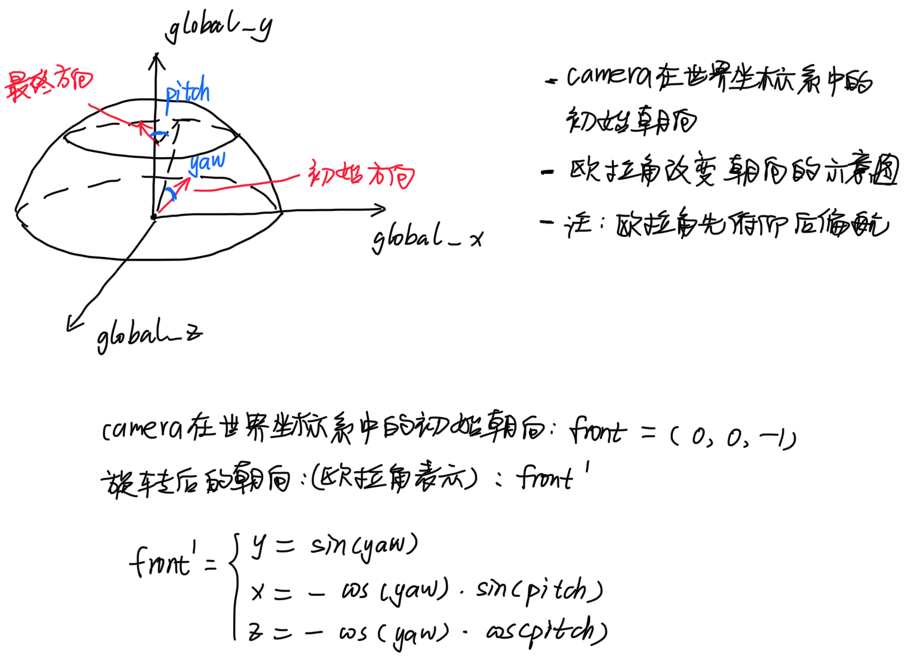
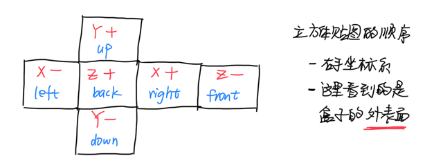
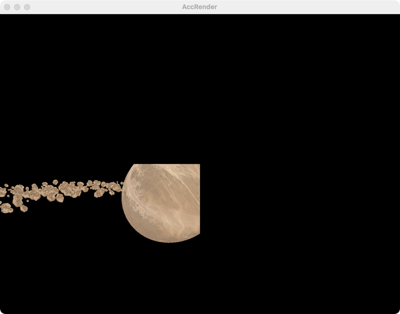

### 1. 摄像机的设置

#### 摄像机的朝向

摄像机在世界坐标系中的初始朝向，以及使用欧拉角表示旋转：



#### 摄像机的局部坐标系

局部坐标系是固定在摄像机上的，示意图为：


注：为了防止欧拉角死锁，以及让参考向量 `up=(0, 1, 0)` 有效，需要限定俯仰角为 `[-89, 89]`

#### 摄像机获得输入输出

目前的做法是：在摄像机中主动查看输入输出系统的数值，改变摄像机的位姿

考虑该用另一种方法：由 render 去获取输入系统的数值，并调用摄像机位姿改变的参数


### 2. 顶点属性的设置

顶点属性标准状态为：

```glsl
layout (location = 0) in vec3 aPos;
layout (location = 1) in vec3 aNormal;
layout (location = 2) in vec2 aTexCoord;
```

某个属性可以没有，也可以纬度不足，单一定要保证上述的 `glsl` 着色器可以兼容识别


VAO 对象的构成：


### 3. 纹理

#### 立方体纹理的顺序

顺序示意图：




### 4. 着色器变量名称

以下内容是通过在 shader 中注入宏定义来实现统一的：
- 顶点属性的编号
- 各种矩阵的名称

#### 为什么有 model 这个类

一个 obj 文件中通常会有多个 mesh，整个 obj 通常是一个整体；model 类就是为了将多个具有关联的 mesh 组织起来的


#### glfw 的窗口尺寸问题

如果屏幕使用了缩放，将导致 glfw 一开始不能正确地显示内容


原因分析：
- 首先以特定的尺寸创建一个窗口，如 `800, 600`，并且将设置 OpenGL `glViewport(0, 0, 800, 600)` 
- 系统自动对该窗口进行缩放，该窗口的实际分辨率达到了 `1600, 1200` ，但并没有引起 `glfwFramebufferSize` 的事件
- 而且，如果此时调用 `glfwGetWindowSize` 查看窗口的尺寸，得到的仍然是 `800, 600`

解决办法就是：
1. 手动地调节一下窗口尺寸
2. 或者在开始时不要调用 `glViewport` 调节窗口的尺寸

